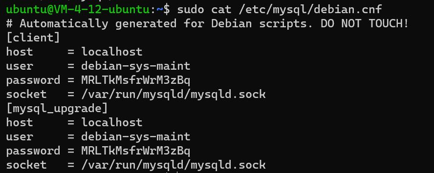

# MySQL安装与配置

## 安装MySQL

``` bash
# 安装MySQL相关依赖
sudo apt install libmysqlclient-dev
# 安装MySQL
sudo apt install mysql-server mysql-client
```

## 查看自动生成的配置文件

``` bash
sudo cat /etc/mysql/debian.cnf
```



``` conf
user     = debian-sys-maint
password = MRLTkMsfrWrM3zBq
```

表示自动配置的默认用户及其密码。

输入`mysql -u debian-sys-maint -p`以使用默认配置登录MySQL，按照提示输入密码。

## 更改root密码

``` sql
use mysql;
update mysql.user 
alter user 'root'@'localhost' 
identified with mysql_native_password
by 'yourpassword';
update user set plugin='mysql_native_password';
```

## 重启MySQL

``` bash
sudo service mysql restart
mysql -u root -p
```

使用刚才修改的密码，以root权限登录。为了远程连接更加方便，修改密码安全级别配置。

``` sql
set global validate_password.policy=0;
set global validate_password.length=1;
```

## 配置MySQL监听

``` bash
sudo vi /etc/mysql/mysql.conf.d/mysql.cnf
```

打开文件后写入以下配置

``` conf
[mysql]
bind-address = 0.0.0.0
```

保存文件后重启服务

``` bash
sudo service mysql restart
```

## 配置远程访问

首先创建一个远程访问用户（`username`和`password`请自行配置）。

``` sql
create user 'username'@'%'
identified by 'password';
```

然后为其授予访问权限

``` sql
grant all privileges
on *.*
to 'username'@'%'
with grant option;
```

远程访问命令如下：

``` shell
mysql -h <yourIP> -u <username> -p <password>
```
